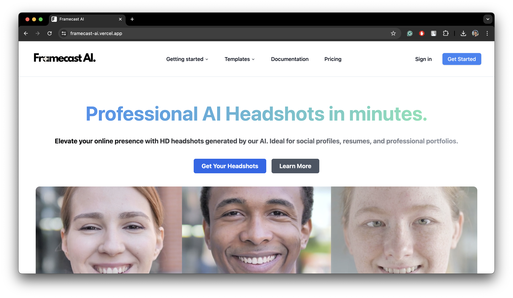
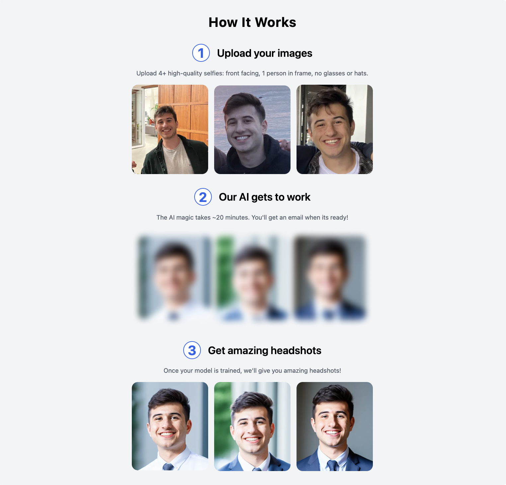
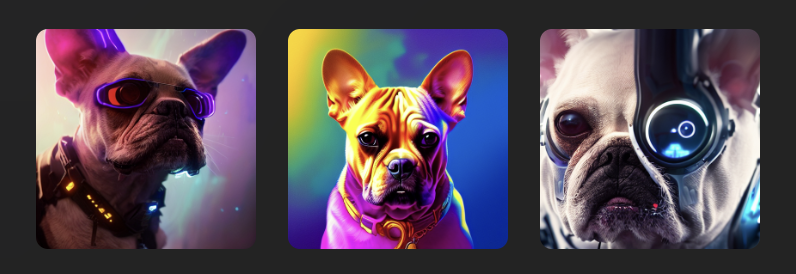

# 👨‍💼 [Framecast AI](https://headshots-starter.vercel.app/) - Professional Headshots with AI (powered by Astria.ai)

Introducing Framecast AI, an intuitive SaaS platform powered by [Astria](https://www.astria.ai/) that generates Professional AI Headshots in minutes.

This product is built to give developers & makers a great starting point into
building AI applications that can generate real revenue. This is your launch pad - modify it,
and make it your own to build a popular AI SaaS app.

[](https://framecast-ai.vercel.app/)

## How It Works

Live demo **[here](https://framecast-ai.vercel.app/)**.

The app is powered by:

- 🚀 [Astria](https://www.astria.ai/) for AI model training & inference
- ▲ [Next.js](https://nextjs.org/) for app and landing page
- 🔋 [Supabase](https://supabase.com/) for DB & Auth
- 📩 [Resend](https://resend.com/) to email user when headshots are ready
- ⭐️ [Shadcn](https://ui.shadcn.com/) with [Tailwind CSS](https://tailwindcss.com/) for styles
- ▲ [Vercel](https://vercel.com/) for deployments
- 💳 [Stripe](https://stripe.com/) for billing

[](https://www.astria.ai/)

## Running Locally

To create your own Framecast AI app, follow these steps:

**Note:**
Training models is only available on paid plans. You'll need an active [Astria
API Key](<[url](https://www.astria.ai/pricing)>) to train models.

### 1. Installing dependencies

Once you purchase the code, move into the folder named `framecast-ai` and
install the necessary dependencies, make sure that you have [node/npm](https://nodejs.org/en) or [yarn](https://yarnpkg.com/) installed
in your system:

```
cd framecast-ai
```

For npm:

```
npm install --legacy-peer-deps
```

For yarn:

```
yarn --legacy-peer-deps
```

### 2. Create an [.env](https://nextjs.org/docs/pages/building-your-application/configuring/environment-variables) file

Use the following titles for your file:

```
# LEAP VARS (AI service)
# Get API key - https://docs.tryleap.ai/authentication
LEAP_API_KEY=

## Generate a random secret
LEAP_WEBHOOK_SECRET=
APP_WEBHOOK_SECRET=

# Get Leap Workflow ID - https://docs.workflows.tryleap.ai/reference/Workflow%20Runs/run_workflow
LEAP_WORKFLOW_ID=


# For local development, you can use the following values:
NEXT_PUBLIC_SUPABASE_URL=
NEXT_PUBLIC_SUPABASE_ANON_KEY=
SUPABASE_SERVICE_ROLE_KEY=
SUPABASE_ANON_KEY=
SUPABASE_URL=


# RESEND VARS (Email service)
RESEND_API_KEY=

# STRIPE VARS (Payment service)
STRIPE_SECRET_KEY=
STRIPE_WEBHOOK_SECRET=
STRIPE_PRICE_ID_ONE_CREDIT=
STRIPE_PRICE_ID_THREE_CREDITS=
STRIPE_PRICE_ID_FIVE_CREDITS=
NEXT_PUBLIC_STRIPE_IS_ENABLED=true # set to true to enable Stripe payments

# DEPLOYMENT (Leave them empty if you're not deploying)
DEPLOYMENT_PROVIDER= # vercel, replit or any of your choice
VERCEL_URL=
REPLIT_URL=
```

### 3. Create a [Astria](https://www.astria.ai/) account

In your `.env` file:

- Fill in `your_api_key` with your [Astria API key](https://www.astria.ai/users/edit#api)
- Fill in `your-webhook-secret` with any arbitrary URL friendly string eg.`shadf892yr398hq23h`


### 4. Create a [Resend](https://resend.com/) account

- Fill in `your-resend-api-key` with your Resend API Key if you wish to use Resend to email users when their model has finished training.

### 5. Configure [Stripe](https://stripe.com) to bill users on a credit basis

The current setup is for a credit based system. 1 credit = 1 model train.

To enable Stripe billing, you will need to fill out the following fields in your `.env` file:

- STRIPE_SECRET_KEY=your-stripe-secret-key
- STRIPE_WEBHOOK_SECRET=your-stripe-webhook-secret
- STRIPE_PRICE_ID_ONE_CREDIT=your-stripe-price-id-one-credit
- STRIPE_PRICE_ID_THREE_CREDITS=your-stripe-price-id-three-credit
- STRIPE_PRICE_ID_FIVE_CREDITS=your-stripe-price-id-five-credit
- NEXT_PUBLIC_STRIPE_IS_ENABLED=false # set to true to enable Stripe payments

You need to do multiple things to get Stripe working:

- Get your Stripe API secret key from the [Stripe Dashboard](https://dashboard.stripe.com/test/apikeys)
- Create a [Stripe Webhook](https://dashboard.stripe.com/test/webhooks) that will point to your hosted URL. The webhook should be listening for the `checkout.session.completed` event. The webhook should point to `your-hosted-url/stripe/subscription-webhook`.
- Create a [Stripe Price](https://dashboard.stripe.com/test/products) for each credit package you want to offer.
- Create a [Stripe Pricing Table](https://dashboard.stripe.com/test/pricing-tables) and replace the script @/components/stripe/StripeTable.tsx with your own values. It should look like this:

```js
<stripe-pricing-table
  pricing-table-id="your-stripe-pricing-table-id"
  publishable-key="your-stripe-publishable-key"
  client-reference-id={user.id}
  customer-email={user.email}
></stripe-pricing-table>
```

Here are the products you need to create to get Stripe working with our example, checkout the images [Here](./public/Stripe/)

To create them go on the Stripe dashboard, search for Product Catalog and then click on the add product button on the top right of the screen. You will need to create 3 products, one for each credit package as shown in the images before. We set them to One time payments, but you can change that if you want to and you can set the price too. After creating the products make sure to update the variables in the .env [your-stripe-price-id-one-credit, your-stripe-price-id-three-credit, your-stripe-price-id-five-credit] with their respective price ids, each price id is found in the product page at the bottom.


### 6. Download [Docker](https://www.docker.com/products/docker-desktop/)

Once you have downloaded and installed docker in your system, open it and
execute the following in your project codebase to run your db server locally:

```
npx install supabase
npx supabase start
```

This will start a virtual container in your docker application and provide you
with the following variables:

```
NEXT_PUBLIC_SUPABASE_URL=your-supabase-url
NEXT_PUBLIC_SUPABASE_ANON_KEY=your-supabase-anon-key
SUPABASE_SERVICE_ROLE_KEY=your-supabase-service-role-key
SUPABASE_ANON_KEY=your-supabase-anon-key (again)
SUPABASE_URL=our-supabase-url (again)
```

### 7. Start the development server:

Now you need to run the development server at the same time, do not close the
last server and run your dev server using the following:

For npm:

```bash
npm run dev
```

For yarn:

```bash
yarn dev
```

### 8. Visit `http://localhost:3000` in your browser to see the running app.

### 9. Authentication 

Once your app is running, you can sign in using your email address. This is a
local environment for now, so you need to visit your docker container terminal,
the place where its server is running and get the ```Inbucket URL```. Go to that
URL after you have signed in using your email address. You will recieve a link
on Inbucket verifying your email address. Go to the monitor tab, click on the
email you recieved using Supabase magic link and click on login. Now you will be
redirected to your logged in page.

### 10. Stopping running container

If you want to stop the running container, you can use the following:

```
npx supabase stop framecast-ai
```

## How To Get Good Results

[](https://blog.tryleap.ai/create-an-ai-headshot-generator-fine-tune-stable-diffusion-with-leap-api/#step-1-gather-your-image-samples-%F0%9F%93%B8)

The image samples used to teach the model what your face looks like are critical. Garbage in = garbage out.

- Enforce close-ups of faces and consider cropping so that the face is centered.
- Enforce images with only one person in the frame.
- Avoid accessories in samples like sunglasses and hats.
- Ensure the face is clearly visible. (For face detection, consider using tools like [Cloudinary API](https://cloudinary.com/documentation/face_detection_based_transformations?ref=blog.tryleap.ai)).

[](https://blog.tryleap.ai/create-an-ai-headshot-generator-fine-tune-stable-diffusion-with-leap-api/#how-to-avoid-multiple-faces-in-results-%E2%9D%8C)

If you get distorted results with multiple faces, repeated subjects, multiple limbs, etc, make sure to follow these steps and minimize the chance of this happening:

- Make sure any samples uploaded are the same 1:1 height / width aspect ratio, for example 512x512, 1024x1024, etc.
- Avoid multiple people in the samples uploaded.
- Add "double torso, totem pole" to the negative prompt when generating.
- Make sure your dimensions when generating are also 1:1 with the same height / width ratios of the samples.

For more information on how to improve quality, read the blog [here](https://blog.tryleap.ai/create-an-ai-headshot-generator-fine-tune-stable-diffusion-with-leap-api/#step-1-gather-your-image-samples-%F0%9F%93%B8).


## Additional Use-Cases

Framecast AI can be easily adapted to support many other use-cases of [Astria](https://www.astria.ai/) including:

- AI Avatars
  - [Anime](https://blog.tryleap.ai/transforming-images-into-anime-with-leap-ai/)
  - [Portraits](https://blog.tryleap.ai/ai-time-machine-images-a-glimpse-into-the-future-with-leap-ai/)
  - [Story Illustrations](https://blog.tryleap.ai/novel-ai-image-generator-using-leap-ai-a-comprehensive-guide/)

[](https://www.astria.ai/)

- Pet Portraits

[](https://www.astria.ai/)

- Product Shots
- Food Photography

[](https://www.astria.ai/)

- Icons
- [Style-Consistent Assets](https://blog.tryleap.ai/how-to-generate-style-consistent-assets-finetuning-on-leap/)

[](https://www.astria.ai/)

& more!

## Resources and Support

- LinkedIn: [Jeryz](https://www.linkedin.com/company/jeryz/)
- Help Email: sharjeelriazsh@gmail.com

